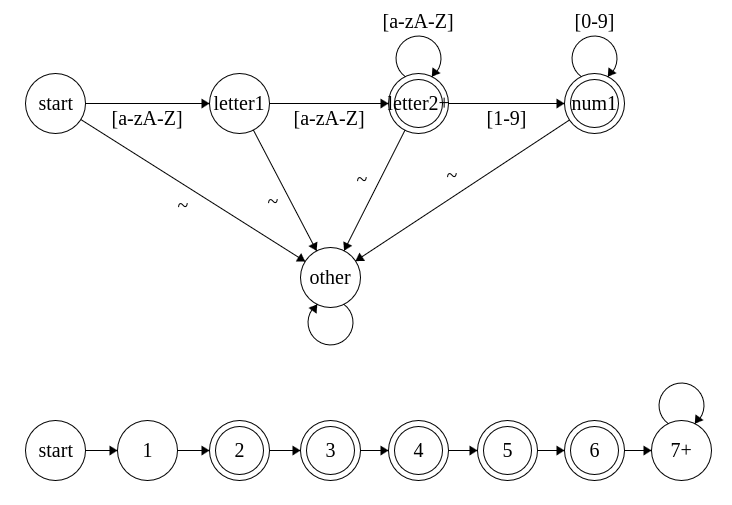

# sm.ts

small state machine library because i was bored

## example

see [`example.ts`](./example.ts) for a state machine implementing the following state machine (see image)

background: I was asked to help with the [cs50p vanity board]() task which boils down to:
> Implement is_valid(s):
> > Return True if s is a valid vanity plate.  
> > Return False otherwise.
>
> Plate:
> - must start with at least two letters.
> - Length must be 2–6 characters.
> - Numbers can only appear at the end.
> - First number cannot be 0.
> - No periods, spaces, or punctuation.
